# APTOS 2019 — Diabetic Retinopathy Staging

🔗 **Live Demo:** [diabetic-retinopathy-app.streamlit.app](https://diabetic-retinopathy-app.streamlit.app)

A deep learning project designed to predict Diabetic Retinopathy (DR) severity grades (0–4, 5-class classification) from retinal fundus images. EfficientNet-B0, ResNet50, and DenseNet121 architectures were trained using transfer learning. DenseNet121 achieved the best performance and was further optimized via discriminative fine-tuning. Grad-CAM was utilized to validate that model decisions align with clinically relevant anatomical features, and the complete pipeline is deployed via a Streamlit web interface.

## Table of Contents

- [Dataset](#dataset)
- [Preprocessing](#preprocessing)
- [Models and Results](#models-and-results)
- [Training Dynamics](#training-dynamics)
- [Fine-Tuning](#fine-tuning)
- [Explainability with Grad-CAM](#explainability-with-grad-cam)
- [Robustness Test: Circular Masking](#robustness-test-circular-masking)
- [Project Structure](#project-structure)
- [Installation and Usage](#installation-and-usage)
- [Streamlit Interface](#streamlit-interface)

## Dataset

The [APTOS 2019 Blindness Detection](https://www.kaggle.com/datasets/mariaherrerot/aptos2019/data) dataset was used, featuring retinal fundus images labeled with 5 DR grades:

| Stage | Class |
|---|---|
| 0 | No DR |
| 1 | Mild |
| 2 | Moderate |
| 3 | Severe |
| 4 | Proliferative DR |

| Split | Image Count |
|---|---|
| Train | 2,930 |
| Validation | 366 |
| Test | 366 |

The class distribution is heavily imbalanced (No DR being the majority class and Severe being the minority, at an approximate 9:1 ratio). This was addressed during training using **weighted Cross-Entropy Loss**.

<table>
<tr>
<td>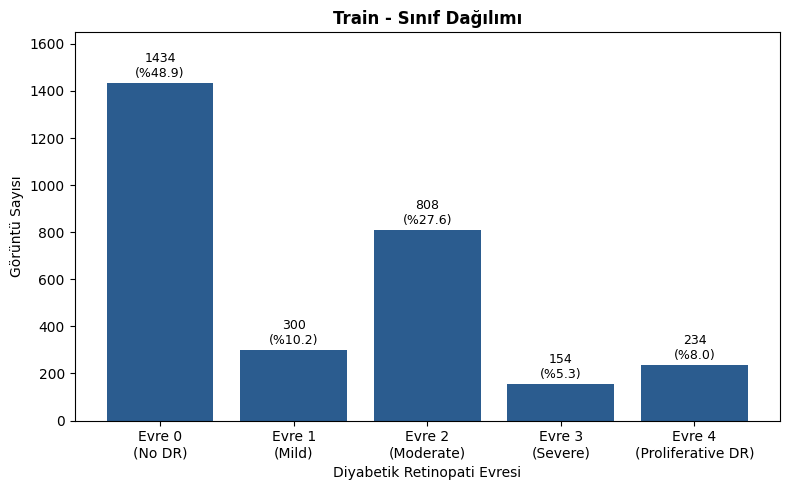</td>
<td>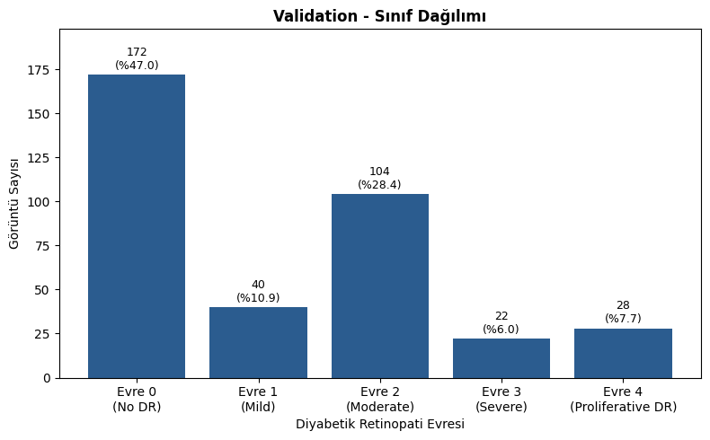</td>
<td>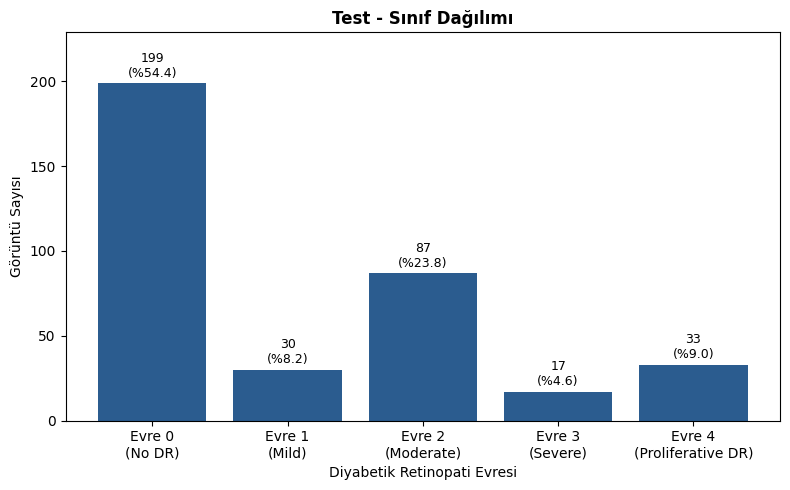</td>
</tr>
</table>

Raw images come in 17 different resolutions, ranging from 474×358 to 4288×2848 pixels.

## Preprocessing

Each image goes through the following pipeline before being fed into the model:

1. **Auto-Crop** — Automatically detects and crops out black image borders using a brightness-threshold-based bounding box.
2. **CLAHE** (Contrast Limited Adaptive Histogram Equalization) — Applied to the L (lightness) channel of the LAB color space to enhance microaneurysms and lesions.
3. **Augmentations via Albumentations** (applied to the training set) — Horizontal/vertical flips, 90° rotations, shift/scale/rotate, followed by resizing to 224×224 and normalization using ImageNet statistics.

The processing logic is modularized in `dataset.py` via `auto_crop()`, `apply_clahe()`, and the `APTOSDataset` class. These functions were separated into a dedicated module to prevent multiprocessing (spawn) issues on macOS.

To avoid redundant real-time processing during every epoch, an optional **pre-caching script** can be run to process and save cropped + CLAHE-enhanced images directly to disk.

**Original vs. Processed (Auto-Crop + CLAHE) Comparison:**

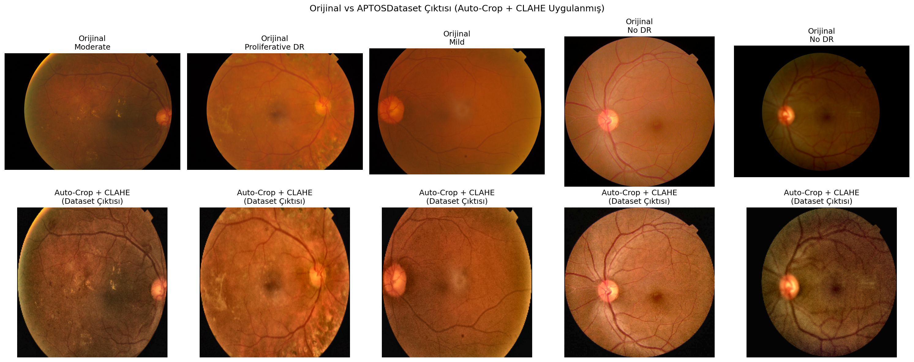

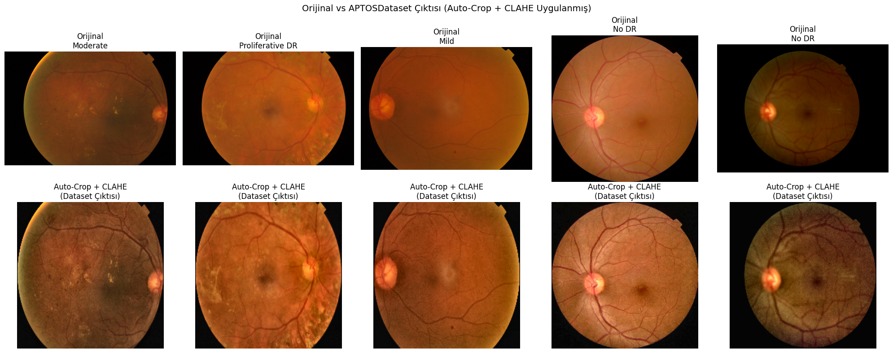

Following CLAHE, capillary networks and lesion boundaries become significantly sharper, making exudates and hemorrhage regions much more distinguishable, particularly in Moderate/Proliferative DR cases.

## Models and Results

Three architectures initialized with ImageNet pre-trained weights were evaluated, with their final classification layers adapted for 5 classes (using weighted Cross-Entropy Loss, AdamW, ReduceLROnPlateau, and early stopping).

### Validation Results

| Model | Accuracy | Macro F1 | Weighted F1 | QWK |
|---|---|---|---|---|
| EfficientNet-B0 | 80.33% | 0.684 | 0.808 | 0.888 |
| ResNet50 | 79.51% | 0.675 | 0.804 | 0.890 |
| **DenseNet121** | **81.69%** | **0.712** | **0.820** | **0.902** |

**QWK (Quadratic Weighted Kappa)** was chosen as the primary success metric due to the ordinal nature of DR grading—meaning a one-step misclassification is penalized less severely than a multi-step error.

DenseNet121 outperformed the other architectures across Accuracy, QWK, and Macro F1, making it the backbone of choice for subsequent fine-tuning experiments.

> **Note — Baseline CNN:** A custom CNN trained completely from scratch was initially tested. However, its learning curve plateaued (train/val loss stagnated around ~1.61, close to the theoretical random guess loss for 5 classes: $\ln(5) \approx 1.609$), indicating that the model failed to learn meaningful representations. Consequently, the baseline was dropped in favor of transfer learning (see [Training Dynamics](#training-dynamics)).

## Training Dynamics

**Baseline CNN — Failed to learn, loss remained constant:**

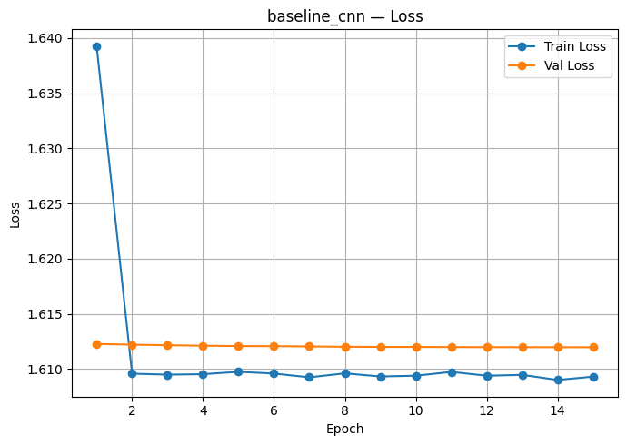

**EfficientNet-B0 — 12 epochs; an abrupt spike in validation loss occurred right before early stopping triggered. The best model checkpoint (saved prior to the spike) was preserved:**

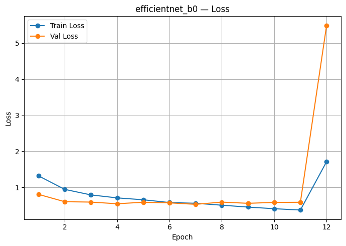

**ResNet50 — 11 epochs; exhibited similar late-epoch instability, with the optimal checkpoint saved prior to the validation loss fluctuation:**

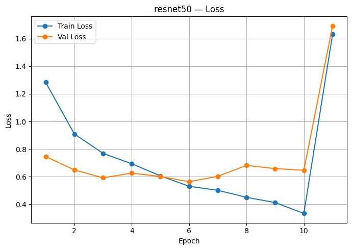

**DenseNet121 — 8 epochs; achieved its lowest validation loss efficiently in earlier epochs:**

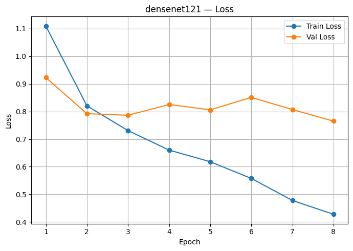

> The late-epoch instability observed in EfficientNet-B0 and ResNet50 is likely caused by the `ReduceLROnPlateau` scheduler failing to lower the learning rate aggressively enough before the model jumped out of a narrow minimum on the class-weighted loss surface. DenseNet121's stable and rapid convergence justified its selection for this task.

## Fine-Tuning

A **QWK-driven, discriminative fine-tuning** strategy was applied to DenseNet121:

- **WeightedRandomSampler** — Applied at the sampling level to complement class weighting.
- **2-Stage Progressive Unfreezing** — Initially unfreezing only the final dense block (`denseblock4`) + classification head, followed by unfreezing `denseblock3` for deeper adaptation.
- **Discriminative Learning Rates** — Higher learning rate for the classifier head and lower rates for the feature extractor to preserve generic ImageNet features.
- **Cosine Annealing + Warmup** scheduler.
- **Mixed Precision (AMP)** for accelerated training.
- Optimal checkpoints selected based on **QWK** instead of validation loss.
- **Test-Time Augmentation (TTA)** — Final evaluation averages predictions from original, horizontally/vertically flipped, and 180°-rotated views.

### Test Set Performance (Fine-tuned DenseNet121 with TTA)

| Metric | Value |
|---|---|
| Accuracy | **83.61%** |
| QWK | **0.894** |
| Macro F1 | 0.666 |
| Weighted F1 | 0.831 |

Fine-tuning yielded a ~2% accuracy improvement over the baseline model on the test set.

**DenseNet121 — Stage 1 (`denseblock4` + Classifier) — Loss and Val QWK:**

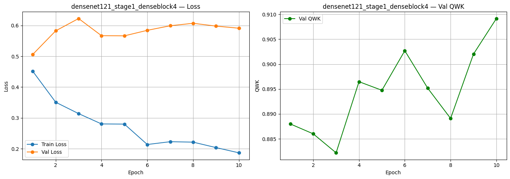

**DenseNet121 — Stage 2 (`denseblock3` + `denseblock4` + Classifier) — Loss and Val QWK:**

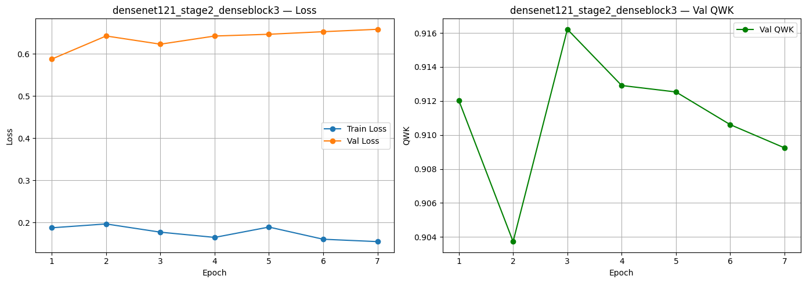

QWK showed a fluctuating yet upward trajectory across both stages, climbing from 0.882 to 0.916 (best epoch).

The same progressive fine-tuning strategy was also tested on **ResNet50** (`layer4` $\rightarrow$ `layer3+layer4`):

**ResNet50 — Stage 1 (`layer4` + FC) — Loss and Val QWK:**

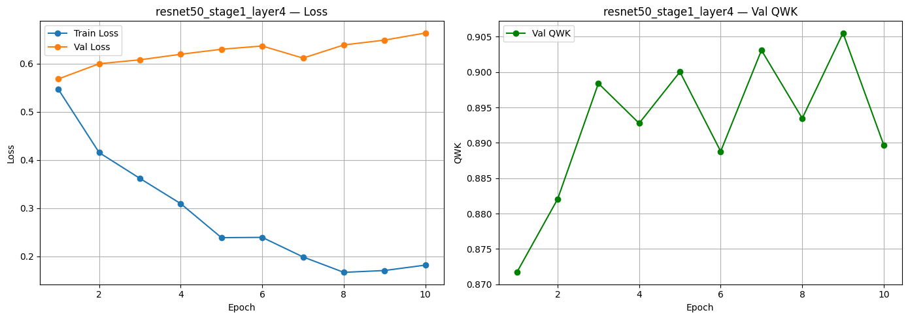

**ResNet50 — Stage 2 (`layer3` + `layer4` + FC) — Loss and Val QWK:**

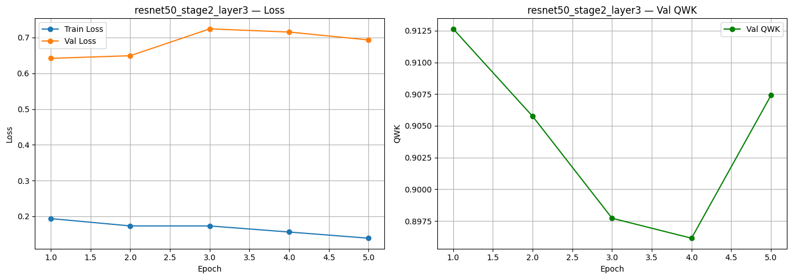

While ResNet50 fine-tuning also pushed QWK from ~0.87 to ~0.91, DenseNet121 was selected for final deployment due to its superior stability and higher sustained QWK.

## Explainability with Grad-CAM

To validate the model's decision-making process, `pytorch-grad-cam` was utilized to generate heatmaps via DenseNet121's final convolutional block:

- Visual inspection confirmed that model predictions focused correctly on clinically relevant pathological regions (exudates, hemorrhages, and the optic disc area) across various DR stages.
- For "No DR" images, heatmaps remained diffused and unfocused, which is clinically expected as no prominent lesions are present.
- Manually overriding the `target_class` parameter (0–4) for the same image demonstrated that the heatmap corresponding to the ground-truth class yielded the most focused and relevant activation.

**Single-sample pipeline flow: Original $\rightarrow$ Auto-Crop+CLAHE $\rightarrow$ Grad-CAM** (Moderate, correctly predicted):

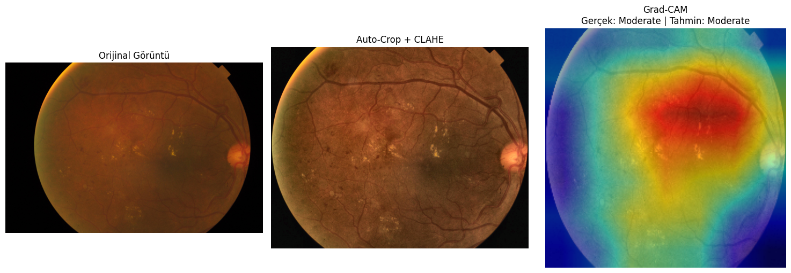

**Sample images from each DR stage alongside their corresponding Grad-CAM heatmaps:**

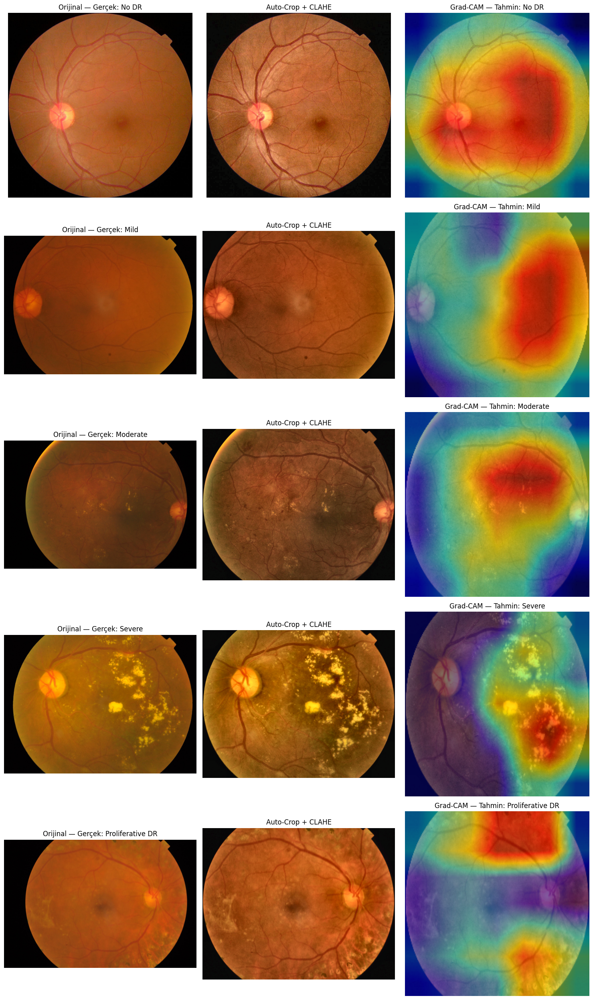

Heatmaps consistently highlight clinical markers such as exudate clusters, hemorrhage zones, and optic disc surroundings.

**Manual override of `target_class` (0–4) for a single Moderate image across all classes:**

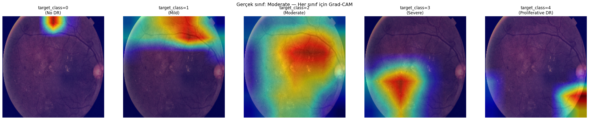

The heatmap corresponding to the true class (`target_class=2`, Moderate) demonstrates the widest and most accurate alignment with visible lesion zones, whereas maps for other classes drift to unrelated areas.

## Robustness Test: Circular Masking

To test whether the model relies on true clinical features or background corner artifacts ("shortcut learning"), a circular mask (blanking out corners) was applied to all 366 validation images to evaluate prediction shift:

| Mask Radius Scale | Prediction Agreement | Accuracy (Unmasked) | Accuracy (Masked) |
|---|---|---|---|
| 1.08 | 79.8% | 85.5% | 74.9% |
| 1.20 | 89.6% | 85.5% | 79.8% |

As the mask radius expanded (retaining more retinal tissue), agreement increased significantly (79.8% $\rightarrow$ 89.6%). Grad-CAM analysis of disagreeing samples revealed that the model primarily targets genuine lesions without heavy reliance on corner artifacts; remaining performance gaps stemmed from distribution shifts since the model was never trained on circularly masked inputs.

> **Note:** Circular masking was strictly implemented as a **robustness/validation test** to audit model behavior post-training. It was omitted from the primary preprocessing pipeline (`dataset.py` / `APTOSDataset`) and training loop. The training and final deployed models operate exclusively on unmasked images (Auto-Crop + CLAHE only).

**Unmasked vs. Masked Grad-CAM Comparison (`radius_scale=1.08`, across 5 stages):**

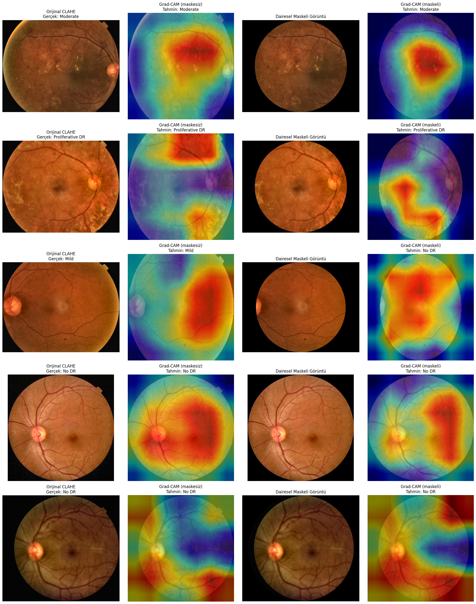

**Increasing the radius (`radius_scale=1.20`) significantly boosts prediction alignment on the same samples:**

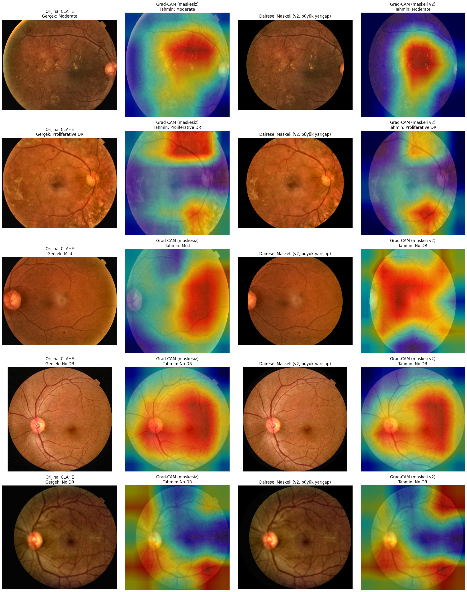

**Samples with prediction shifts (`radius_scale=1.08`)** — primarily border-line transitions between adjacent stages (e.g., Moderate $\leftrightarrow$ Mild, Mild $\leftrightarrow$ No DR); heatmaps remained anchored near lesion regions post-masking:

<table>
<tr>
<td>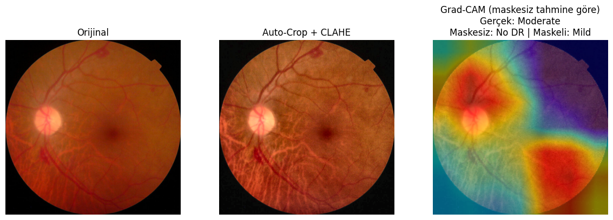</td>
</tr>
<tr>
<td>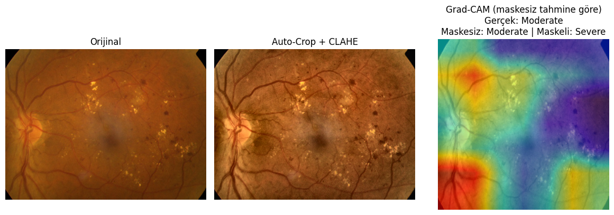</td>
</tr>
<tr>
<td>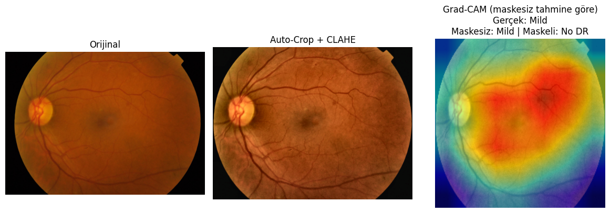</td>
</tr>
<tr>
<td>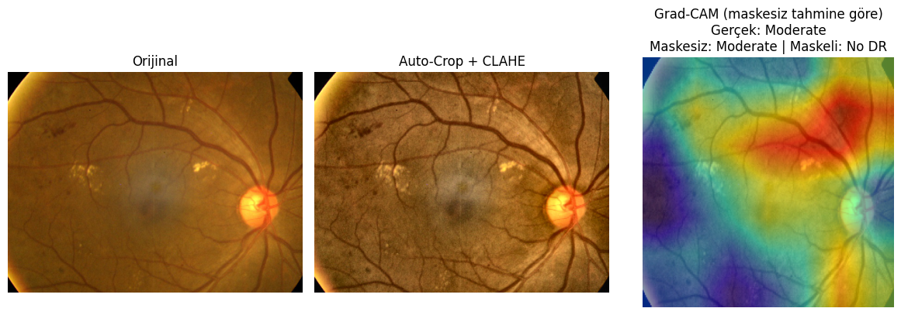</td>
</tr>
<tr>
<td>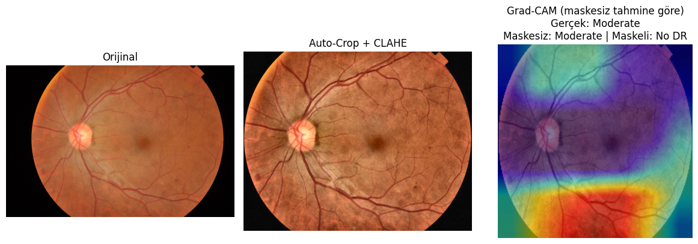</td>
</tr>
</table>

## Project Structure


```

├── aptos_2019.ipynb          # Main notebook — EDA, preprocessing, training, evaluation, Grad-CAM
├── dataset.py                 # auto_crop, apply_clahe, APTOSDataset
├── model_utils.py              # Model loading, inference, preprocessing helpers
├── gradcam_utils.py            # Grad-CAM generation and visualization
├── app.py                     # Streamlit web interface
├── requirements.txt
├── checkpoints/
│   ├── efficientnet_b0_best_model.pth
│   ├── resnet50_best_model.pth
│   ├── densenet121_best_model.pth
│   └── densenet121_stage2_best_qwk.pth   # Fine-tuned final model
└── README.md

```

## Installation and Usage

```bash
pip install -r requirements.txt

```

The notebook auto-detects the execution environment (Kaggle / Google Colab / Local) and adjusts data/checkpoint paths accordingly.

The image dataset and trained weights are excluded from this repository due to storage limits and should be supplied externally via Kaggle Datasets or Google Drive.

## Streamlit Interface

```bash
streamlit run app.py

```

The web app performs the following for any uploaded retina image:

1. Applies Auto-Crop + CLAHE preprocessing,
2. Predicts the DR stage and confidence score using the fine-tuned DenseNet121 model,
3. Overlays the Grad-CAM heatmap onto the original image for visual validation.

> ⚠️ This tool is intended for educational and research purposes only and does not replace professional medical diagnosis.

```

```
